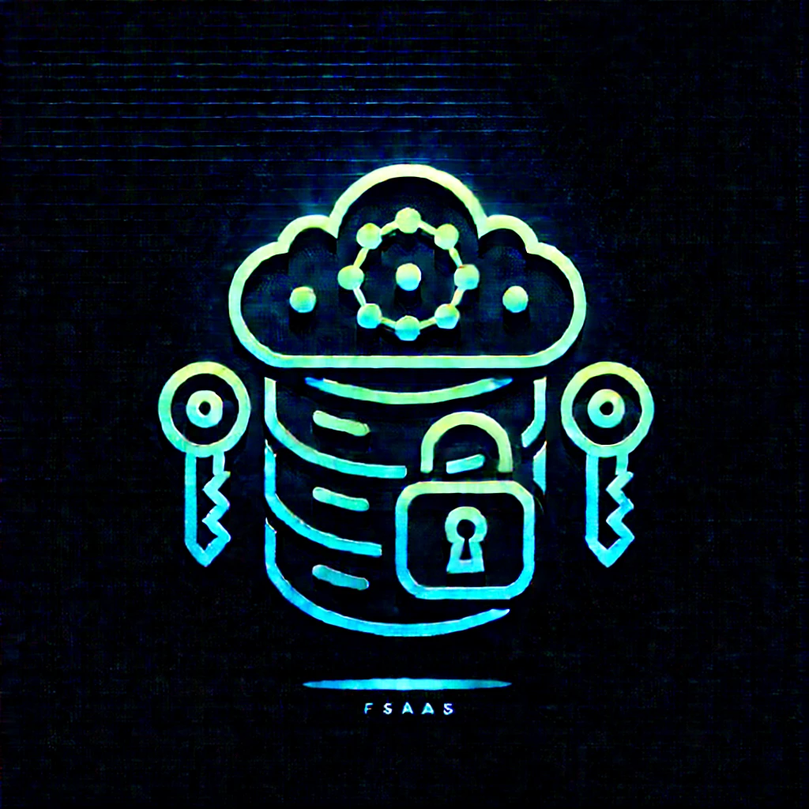

# Secure-File-Storage-as-a-Service

SFSaaS is a cloud simulation project that mimics the behavior of a secure file storage system. This project demonstrates key concepts of cloud storage, cryptography, authentication mechanisms, and client-server communication using **gRPC**.

## 🔐 Key Features

- **Asymmetric Cryptography**: A custom cryptographic algorithm is implemented to generate asymmetric key pairs used to secure communication between the client and the server.
- **gRPC Communication**: The server uses Google Remote Procedure Call (gRPC) to simulate fast and efficient communication between clients and the cloud server.
- **Two-Factor Authentication**:
  - **Machine Authentication**: The client machine is authenticated using a simulated digital certificate (represented as a Python dictionary).
  - **User Authentication**: After the machine is verified, the user must authenticate using a username and password.
- **User can only access their files**: A user can't access another user file.
- **File Storage Simulation**: Mimics a secure and structured file storage system in the cloud.

## 📁 Project Structure

The system is built on a client-server architecture:

- **grpc Cloud Server**: Handles file storage operations, authentication requests, and manages user sessions
- **Client**: Provides interface for users to interact with the cloud storage system
- **Authentication Module**: Processes two-factor authentication (machine + user)
- **Cryptography Module**: Manages key generation, encryption, and decryption

## 🚀 Getting Started

### Prerequisites

- Python 3.8+
- `grpcio` and `grpcio-tools`
- `cryptography`

### Installation

1. Clone the repository
2. pip install -r requirements.txt
3. To run the cloud server : python3 cloud_server_grpc.py
4. To run a client : python3 cloud_client.py

### 📚 Technologies Used

    Python
    gRPC
    Custom Cryptographic Algorithms

## Technical Details

### Cryptography Implementation

- **The system implements a custom asymmetric key generation algorithm that**:
Creates public-private key pairs for secure communication
Ensures data confidentiality and integrity during transmission
Provides non-repudiation for critical operations

### Authentication Flow

- **Machine Authentication**:
Client machine presents its digital certificate
Server validates certificate authenticity
If valid, proceeds to user authentication

- **User Authentication**:
User provides username and password
Server verifies credentials against stored data
Upon successful verification, grants access to cloud resources

- **User The Following credential to authenticate**:
Username : Neymar
Password : BestPlayer
  - **You can have other credential by doing static code analysis** 

## CTF
- **Produse a man in the middle attack and try to intercep data that are not encrypted**
- **Encrypt the rest of data that have not bee encrypted**
